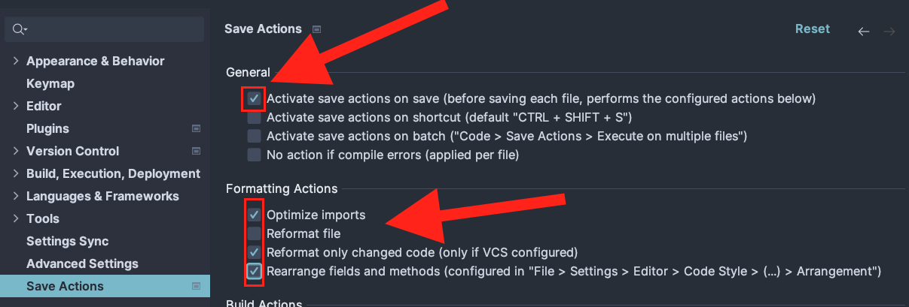

# Ellmental(2)

## Contributing

We use IntelliJ IDEA for development. You can import the project as a Gradle project.

Install the `Save Actions Tool` plugin by `Alexandre DuBreuil` to automatically format the code on save.

Make sure you've configured it like this in your IDE (although it should be already configured because we
checked in the settings file):

### Adding a new package into the monorepo

1. Duplicate the `.kotlin-template` folder and rename it to your package name.
2. Add the package name to the `settings.gradle.kts` file, in the `includes` list.
3. ???
4. Profit!