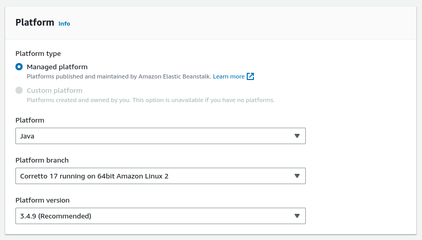
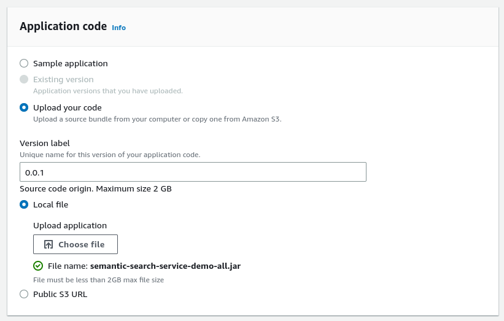
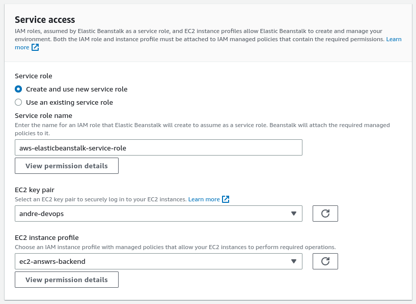
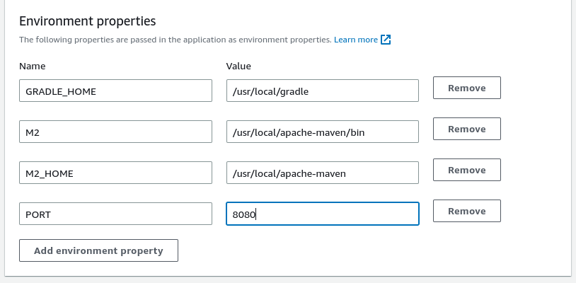

# AWS Elastic Beanstalk

This document will show you how to deploy the eLLMental application to AWS. It requires little to no previous knowledge of AWS, but it is recommend to be at least familiar with EC2 terminology. The only requirement for this walkthrough is that you have an AWS account. It also won't breach free tier if the smaller free tier instances are selected (this is selected by default).

## Intro to Beanstalk

Beanstalk is an AWS service created to do quick deployments without worrying about designing systems and connecting different services. It requires little configuration and most default settings are good enough for standard deployments. The nice thing about Beanstalk is that it can be tailored to your needs if necessary and it offers pretty advanced configuration options if required.

## Creating a Beanstalk Service

First step is to access the AWS console and select the `Beanstalk Service`. While in the service page, click on __create environment__. You'll be taken to a new page with a six steps panel on the left.

> Make sure you have the correct region

Fill in all the fields in the first step until you arrive in the `Platform card` like the image below. Keep all the prefilled fields in there default values. The others are mostly name fields and you can fill them however you like.

For the Platform card follow the image while selecting the options.

Quick explanation of the fields:

- __Platform__: what's the runtime of the application
- __Platform Branch__: what's the version of the runtime (Correto is AWS's Java implementation)
- __Platform version__: this is the AWS platform environment version, doesn't have anything to do with the runtime. 

The next card `Application Code` also needs to be changed. First, select the `Upload you code` radio button. Then, in version fill it with whatever versioning system you prefer. In this case we went with the `0.0.1` semantic version. Finally, select `Upload your code` and select the jar file you've built for your service.

Continue to the next step by clicking the next button on the bottom right. On the next page called `Configure service access` find the `Service Access` card like the image below. You can leave every other card in their default configuration. For the Service access card, select the __Create and use new service role__ and provide any name in the next field. For the `EC2 key pair` field, create a new pair in the EC2 service page, it will appear in the left menu of this page and is straightforward to create.

> If you are not familiar with key pairs, they are basically the ssh keys required to access the machine. We won't be using them, but it's a good idea to have them for long term deployments. 

The `EC2 instance profile` is a little more complicated to setup but if you click on the `View permission details` it will show you how to create a profile for your instance.

For the last part we need to set an environment variable so that the Beanstalk environment can access the server. Default Beanstalk applications run on port `5000`, but since our application runs on `8080` by default, we have to add the PORT variable. The image below shows this configuration, the name of the env is `PORT` while the value is `8080`. You can ignore the first three, they are default values set by Beanstalk.

Now you can jump to the last step called __review__ and then on the bottom right click on submit. You will be taken to a new page with a summary of your application information. It will take a few minutes until Beanstalk configures your environment. You can follow any issues in the events tab. If the deployment succeeds you'll see an `OK` status in the `Health` field.

To test your deployment you can curl or use the browser to access the URL that appears in the `Domain` field. Make sure to make requests to endpoints that exists in the backend. 