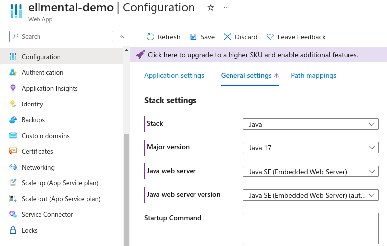

# Azure Web Apps

This document will show you how to deploy the __eLLMental__ application to Azure. It requires little to no previous knowledge of Azure, but it is recommend to be at least familiar with some of it's basic terminology. The only requirements for this walkthrough is that you have an Azure account and the [azure](https://learn.microsoft.com/en-us/cli/azure/install-azure-cli) CLI installed in your system. It also won't breach free tier if the smaller free tier instances are selected (this is selected by default).


## Intro to Web Apps

The Web Apps service is an Azure service created to do quick deployments without worrying about designing systems and connecting different services. It requires little configuration and most default settings are good enough for standard deployments. The nice thing about Web Apps is that it can be tailored to your needs if necessary and it offers pretty advanced configuration options if required.


## Creating a Web Apps Service

Once you have your Azure account and installed the `azure CLI` to your system, you can then clone this repository to your local computer. The following steps will assume that you have done that and that you are running the command from inside the repo root folder.

1. (__Optional__) First make sure to [install](https://learn.microsoft.com/en-us/cli/azure/install-azure-cli) and login to the azure CLI in your preferred terminal. To login just run the command `az login`.


2. Then, you'll need to change the `build.gradle.kts` file inside the `semantic-search-service-demo` folder. Once you open the file, you'll need to change the attributes below that can be found inside the __azurewebapp__ configuration brackets.


```JSON
resourceGroup = "ellmental-demo-rg" // Make sure to add a Resource Group that exists
appName = "ellmental-demo" // Needs to be globally unique
pricingTier = "F1" // Choose a pricing tier, can be free.
region = "westus3"
```
> The other values you can leave as default. You can get more information [here](https://github.com/microsoft/azure-gradle-plugins/wiki/Webapp-Configuration)

3. Once you're done configuring your application you can run the deployment command. It uses a Gradle plugin made for Azure Web Apps deployment. 

```sh
    ./gradlew  semantic-search-service-demo:azureWebAppDeploy
```
> Make sure your application port is set to `80`. If your application uses environment variables make sure to add the port one in the __setAppSettings__ config inside the `build.gradle.kts` file

It will take some time to finish but once it is done, you can go to the Azure website in the App Service section to check the status of your deployment.

4. There is an issue with the current version of the deployment plugin that doesn't setup the stack inside the container, it will run `Java 8` by default. To change that go to the _Web App_ page in the Azure web site. Go to configurations in the left menu then select the `General settings` tab on the right side. Finally, change the configuration there to match the one in the image below.



Then save and this will take some time to redeploy. But after a few minutes, depends on the image size, your application will be up and running. To confirm this go to the `Overview` option in the left menu on the Azure browser and click on the `Default domain` link.